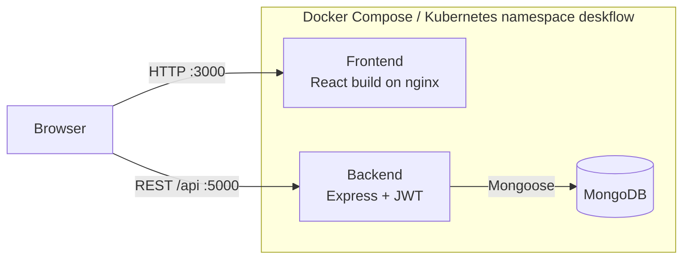
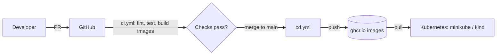

# DeskFlow Architecture

```mermaid
flowchart LR
  U[Browser] -->|HTTP :3000| FE[Frontend<br/>React build on nginx]
  U -->|REST /api :5000| BE[Backend<br/>Express + JWT]
  BE -->|Mongoose| DB[(MongoDB)]
  subgraph Docker Compose / Kubernetes namespace deskflow
    FE
    BE
    DB
  end
```

```mermaid
flowchart LR
  Dev[Developer] -->|PR| GH[GitHub]
  GH -->|ci.yml: lint, test, build images| CI{Checks pass?}
  CI -->|merge to main| CD[cd.yml]
  CD -->|push| GHCR[(ghcr.io images)]
  GHCR -->|pull| K8s[Kubernetes: minikube / kind]
```

## Health checks
- Liveness: `GET /api/health` (backend), `GET /healthz` (frontend)
- Readiness: `GET /api/ready` returns 503 until MongoDB is connected
